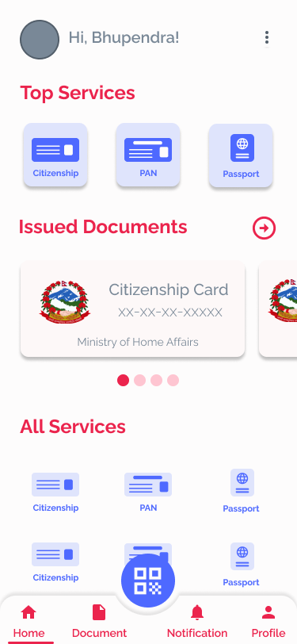
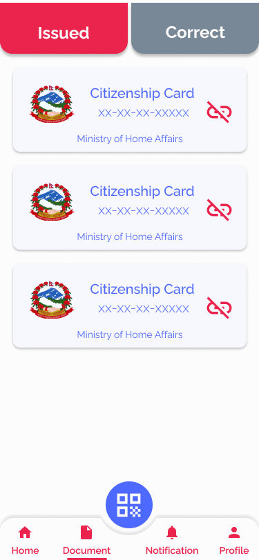

# Nagarik Designs
Explore the captivating designs tailored for the [Nagarik frontend](https://github.com/lorem-ipsum-group/nagarik).

<table>
  <tr>
    <td>Select Langauge</td>
    <td>Onboarding Screen 1</td>
    <td>Onboarding Screen 2</td>
  </tr>
  <tr>  
    <td></td>    
    <td></td>
    <td></td>
  </tr>
  <tr>
    <td>Sign Up</td>
    <td>Home</td>
    <td>Document Listing</td>
  </tr>
  <tr>
    <td></td>
    <td></td>
    <td></td>
  </tr>
</table>

## License
This project is licensed under the MIT License - see the [LICENSE](LICENSE) file for details.
